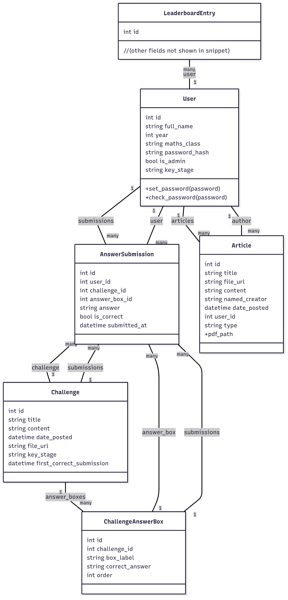

# Maths Society Web Application — Technical Documentation

## Overview

A comprehensive web application for Upton Court Grammar School's Maths Society, designed to enhance mathematical engagement through challenges, leaderboards, and newsletters. The platform is built with Flask (Python), SQLAlchemy ORM, Jinja templating, and uses PostgreSQL or SQLite as the backing database.

---

## Table of Contents

- [1. Architecture Overview](#1-architecture-overview)
- [2. Directory Structure](#2-directory-structure)
- [3. Core Modules](#3-core-modules)
  - [3.1 Authentication & Authorization](#31-authentication--authorization)
  - [3.2 User Management](#32-user-management)
  - [3.3 Challenges & Answers](#33-challenges--answers)
  - [3.4 Articles & Newsletters](#34-articles--newsletters)
  - [3.5 Leaderboard System](#35-leaderboard-system)
  - [3.6 Announcements](#36-announcements)
- [4. Database Models](#4-database-models)
- [5. Forms](#5-forms)
- [6. Configuration & Deployment](#6-configuration--deployment)
- [7. Security Practices](#7-security-practices)
- [8. Testing](#8-testing)
- [9. Development & Contribution](#9-development--contribution)
- [10. References & Diagrams](#10-references--diagrams)

---

## 1. Architecture Overview

- **Backend:** Python (Flask), SQLAlchemy ORM
- **Frontend:** Jinja2 templating, HTML5, CSS3, Bootstrap
- **Database:** PostgreSQL (production), SQLite (development/testing)
- **Forms:** Flask-WTF, WTForms
- **Rich Text:** CKEditor integration for content creation
- **Authentication:** Username/password (hashed), session-based
- **Authorization:** Admin/user roles
- **Deployment:** WSGI (gunicorn/uWSGI), Docker/Heroku/AWS supported



---

## 2. Directory Structure

```layout
math_soc/
│
├── app/                # Main application package
│   ├── __init__.py     # App factory and extension setup
│   ├── models.py       # SQLAlchemy ORM models
│   ├── database.py     # DB initialization
│   ├── auth/           # User authentication (login/register)
│   ├── main/           # Core routes (homepage, etc.)
│   ├── admin/          # Admin dashboard and management
│   ├── profile/        # User profile and settings
│   ├── static/         # CSS, images, JavaScript
│   └── templates/      # HTML/Jinja templates
│
├── migrations/         # Alembic database migrations
├── tests/              # Pytest test suite
│   ├── auth/
│   ├── main/
│   ├── admin/
│   └── profile/
│
├── docs/               # Sphinx documentation
│   └── source/
│       ├── installation.rst
│       ├── development.rst
│       ├── deployment.rst
│       ├── api/
│
├── config.py           # Environment-based configuration
├── .env                # Local environment variables (not committed)
├── requirements.txt    # Python dependencies
├── README.md           # Project overview
└── LICENSE
```

---

## 3. Core Modules

### 3.1 Authentication & Authorization

- **app/auth/**
  - Handles registration, login, logout.
  - Registration form checks for duplicate users, profanity in names, and requires password confirmation.
  - Passwords are hashed.
  - Authorization enforced via Flask-Login and custom `@admin_required` decorator (see `app/admin/routes.py`).

### 3.2 User Management

- **Profile (app/profile/)**
  - Users can view and edit personal data.
  - Change password (requires current password, confirmation).
  - Delete account (with confirmation).

- **Admin (app/admin/)**
  - Admins can create, edit, and delete users.
  - Admin privilege is strictly controlled.

### 3.3 Challenges & Answers

- **Challenges (app/admin/, app/main/)**
  - Admins create and manage math challenges.
  - Each challenge can have multiple answer boxes (for multi-part answers).
  - Users submit answers; submissions are tracked and correctness is evaluated.

### 3.4 Articles & Newsletters

- **Articles/Newsletters (app/admin/)**
  - Admins can post articles or newsletters.
  - Rich text and PDF upload supported.
  - Visible to all users.

### 3.5 Leaderboard System

- **Leaderboards (app/models.py, app/profile/)**
  - Tracks user scores based on challenge performance.
  - Displayed on user profiles and possibly on public boards.

### 3.6 Announcements

- **Announcements (app/admin/)**
  - Admins can post announcements visible to all users.

---

## 4. Database Models

See `app/models.py` for full definitions. Key entities:

- **User**: Registered site users (students/admins)
- **Challenge**: Math problems posted by admins
- **ChallengeAnswerBox**: Specific answer fields for each challenge
- **AnswerSubmission**: User submissions for each challenge/box
- **Article**: Articles/newsletters by admins
- **LeaderboardEntry**: Tracks user scores
- **Announcement**: Site-wide announcements

Relationships are shown in the [class diagram](#1-architecture-overview).

---

## 5. Forms

All user input is handled with Flask-WTF forms, including:

- Login, Registration (with password confirmation)
- Change Password
- Create/Edit Challenges, Articles, Announcements
- File uploads (validated type/size)
- User management (admin only)

All forms include CSRF protection.

---

## 6. Configuration & Deployment

- **config.py** manages environment-specific settings (dev, prod, test).
- All secrets, DB credentials, and environment flags are set via `.env` file.
- Production deployments use a WSGI server and a managed database.
- Static files are served via Flask or a CDN in production.
- Database migrations handled by Alembic (`migrations/`).

---

## 7. Security Practices

- Passwords are hashed; no plain text storage.
- Registration and login are CSRF-protected.
- Profanity and duplicate checks during registration.
- Admin-only endpoints protected by custom decorator.
- File uploads restricted by type (PDF) and should be scanned for size/type.
- Secure session cookie flags recommended in production config.
- HTTPS, HSTS, and secure headers should be enforced in production (Flask-Talisman suggested).
- Rate limiting recommended for login/registration endpoints (see [SECURITY_CHECKLIST.md](SECURITY_CHECKLIST.md)).

---

## 8. Testing

- Comprehensive Pytest suite in `tests/`:
  - Authentication and registration flows
  - User CRUD operations
  - Challenge and article posting
  - Profile management (change password, delete account)
- See `tests/` for coverage.

---

## 9. Development & Contribution

- Follow PEP 8 and use type hints.
- Use feature branches and Pull Requests for contributions.
- All new features must be tested.
- Documentation built via Sphinx (`docs/source`).

---

## 10. References & Diagrams

- [Class Diagram (mermaid.png)](mermaid.png)
- [Security Checklist](SECURITY_CHECKLIST.md)
- Full API and module documentation in `docs/source/api/`
- For deployment, see `docs/source/deployment.rst`

---

## Contact

For technical support or collaboration:
- Yousuf Shahzad
- Sudhakara Ambati
- Upton Court Grammar School
